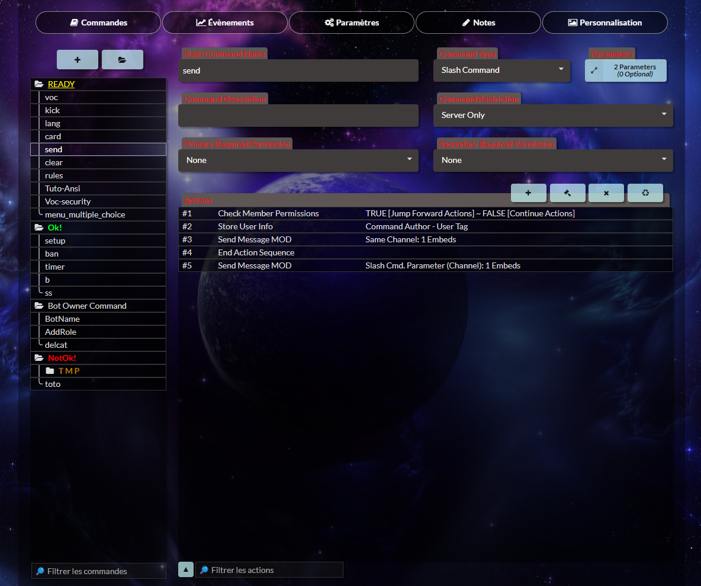
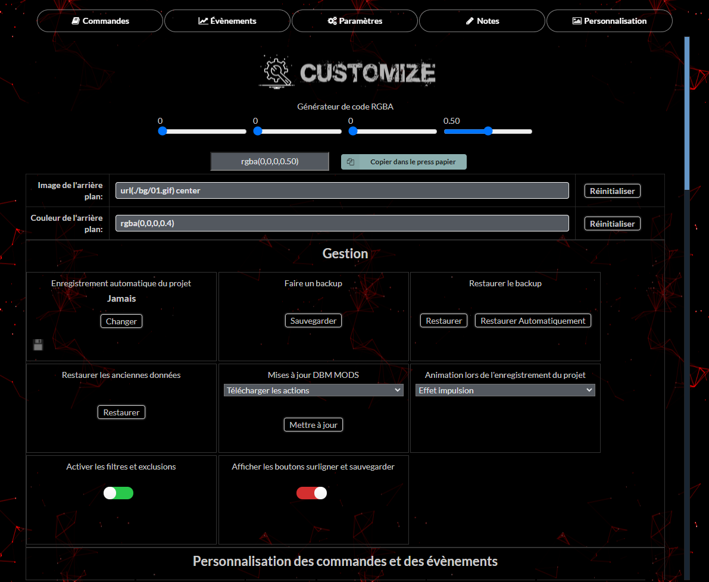
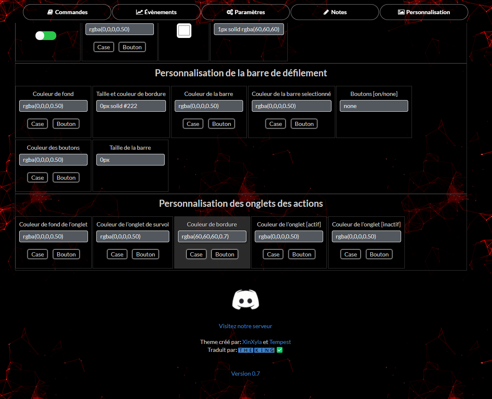

<p align="center">
  
</p>


<a href="https://discord.gg/HBc9u9tktd" rel="nofollow">DBM BRAZIL MODS</a> est une communauté multi langage dédiée à la modification, l'extension et l'amélioration de <a href="https://store.steampowered.com/app/682130/Discord_Bot_Maker" rel="nofollow">Discord Bot Maker</a> nous nous efforçons d'unir les communautés de tous les pays, rejoins nous !

# <Yossur-Project-Title>

## Description

Theme complètement personnalisable pour Discord Bot Maker V2.0 traduit en français

## Table of Contents

- [Installation](#installation)
- [Screenshots](#screenshots)
- [Credits](#credits)
- [License](#license)

## Installation
```md
- Fermez Discord Bot Maker
- Déposez le dossier Resources ici -> "Steam\steamapps\common\Discord Bot Maker"
- Relancez Discord Bot Maker
```

## Screenshots



---


---


---

<h1 align="center">License</h1>
<p align="center">Open Source</p>


<h1 align="center">Credits</h1>
<p align="center">
  Theme créé par: <a href="https://discord.com/users/172782058396057602" rel="nofollow">XinXyla</a> et <a href="https://discord.com/users/321400509326032897" rel="nofollow">Tempest</a>
  </p>
<p align="center">Traduit par: <a href="https://discord.com/users/1042087216979116032" rel="nofollow">🆃🅷🅴 🅺🅸🅽🅶 ✅</a>
  </p>
